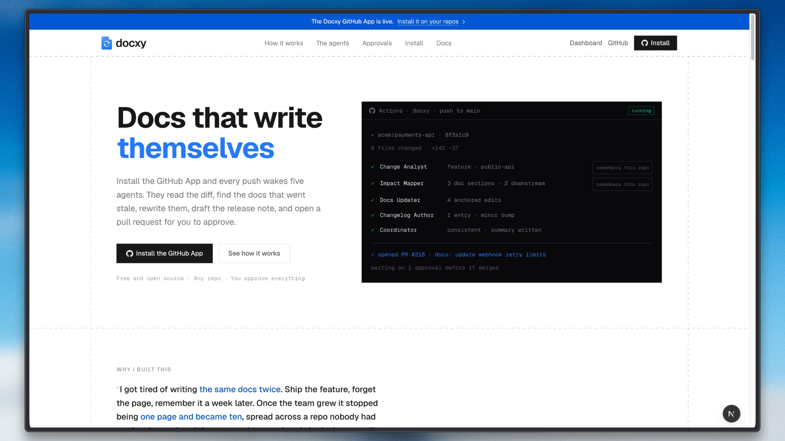

# Docxy

A multi-agent documentation-and-changelog pipeline built on [TrueForge](https://trueforge.dev),
TrueFoundry's open-source agent harness, with models served by
[Nebius Token Factory](https://tokenfactory.nebius.com).

Every push to `main` wakes five specialists. One classifies what changed. One
traces which docs and downstream code the change actually touches. Two draft the
edits — reference docs and release notes, in deliberately different voices. The
last reviews their work before anything is published. Everything is validated
first, and **a proposal that fails those checks opens as a draft that says why,
never as a clean pull request.**

**→ [Set it up locally](guides/LOCAL-SETUP.md)** — from nothing to a
documentation pull request on your own repository.

---

## Why this, and not something that already exists

| Existing tool | What it does | Where it stops |
|---|---|---|
| [Swimm](https://swimm.io) | Watches commits, auto-syncs doc snippets | One flat pass — no impact-mapping step, no changelog, nothing validated before it lands |
| [Mintlify automate-agent](https://www.mintlify.com/docs/guides/automate-agent) | GitHub Action → hosted agent job → docs PR | Closest structural precedent, but one proprietary job tied to one platform — no open harness, no changelog, no validation step |
| semantic-release / Release Please | Generate changelogs from commit messages | Reads intent from the commit message, not the diff — brittle when commit hygiene slips, blind to downstream impact |
| Dependency-graph / blast-radius tools | Trace what a change affects | Produce a report a human still has to act on — not wired into anything that drafts and gates a fix |

Every existing tool owns one slice as a single flat pass. Nobody chains
*classify → map impact → draft docs → author changelog → validate → gate behind
approval* as cooperating specialists with distinct judgment. That is the shape
this project builds.

---

## How it works

```
                          push to main
                               │
                               ▼
                    ┌──────────────────────┐
                    │    Change Analyst    │  breaking / feature / fix / chore
                    │  breaking-change-    │  public-api / internal / config / test
                    │      policy          │
                    └──────────┬───────────┘
                               ▼
                    ┌──────────────────────┐
                    │    Impact Mapper     │  which doc sections went stale,
                    │  impact-map-hints    │  which downstream code follows
                    └──────────┬───────────┘
                               │
                 ┌─────────────┴─────────────┐
                 ▼                           ▼
      ┌────────────────────┐      ┌────────────────────┐
      │   Docs Updater     │      │  Changelog Author  │
      │    docs-style      │      │  changelog-voice   │
      │ instructional prose│      │  terse release note│
      └─────────┬──────────┘      └─────────┬──────────┘
                └─────────────┬─────────────┘
                              ▼
                    ┌──────────────────────┐
                    │      Validation      │  anchors resolve · links resolve
                    │   (docs build in a   │  semver consistent · tests
                    │        sandbox)      │  docs build runs in the sandbox
                    └──────────┬───────────┘
                               ▼
                    ┌──────────────────────┐
                    │     Coordinator      │  rejects inconsistent work,
                    │                      │  writes the human summary
                    └──────────┬───────────┘
                               ▼
                    ┌──────────────────────┐
                    │    Approval gate     │  routine = 1 sign-off
                    │                      │  elevated = 2, different people
                    └──────────┬───────────┘
                               ▼
                        pull request
```

### The five roles

| Role | Job | Skill pack |
|---|---|---|
| **Change Analyst** | Classifies the diff; extracts the plain-language what and why | `breaking-change-policy` |
| **Impact Mapper** | Finds which doc sections and downstream files the change touches | `impact-map-hints` |
| **Docs Updater** | Drafts the smallest edit that makes each section correct | `docs-style` |
| **Changelog Author** | Writes one user-facing entry and proposes a semver bump | `changelog-voice` |
| **Coordinator** | Reviews all four, rejects inconsistent work, writes the summary | — |

Run `docxy roles` to see the roster with its current model assignments.

---

## Three design decisions worth explaining

### 1. One session per role, per repository — so state accumulates

TrueForge spawns subagents dynamically (via its built-in `create_sub_agent`
tool); it has no concept of a fixed, named roster. So instead of one session
per commit, **each role holds its own long-lived TrueForge session per
repository**, and the orchestration order lives in code.

That is not a workaround — it is the better shape for this problem. What a role
learns on one commit is still there for the next one. Alongside the sessions, a
`symbol → doc-section` map is persisted to disk and handed to the Impact Mapper
on every run, so it reuses what it already worked out instead of re-deriving it.

The timeline marks each role **"session reused"** when this happens. Running the
pipeline on two commits back to back makes the payoff visible:

```bash
npm run demo                                    # builds a 2-commit demo repo
npx tsx src/cli.ts run HEAD~1 --repo .demo-repo # first: learns the repo
npx tsx src/cli.ts run HEAD   --repo .demo-repo # second: reuses what it learned
```

### 2. Validation runs before a human sees anything

The most common failure mode of an LLM editing prose is quoting text that isn't
there. So the first validation check is the strictest: **every proposed edit
must anchor to text that appears verbatim, exactly once**, in the real file. A
paraphrased anchor is caught and the run fails rather than producing a broken
patch.

On top of that: relative links and in-page anchors must resolve, and a `breaking`
classification paired with anything below a `major` bump is rejected as
internally inconsistent. Your repo's own docs-build and test commands run too,
if you configure them.

The checks divide by who wrote what they run over. Anchors, links and semver
consistency only *read* the proposed text. The docs build **executes** it — a
command, over prose a model finished writing a minute earlier — so that one runs
**inside the harness sandbox**, never against your checkout. A run stages the
proposal into a fresh sandbox, builds it there, and reports the exit code back:

```
validation
  ✓ edits-apply         3 file(s) patched cleanly
  ✓ link-check          no broken relative links or anchors
  ✓ semver-consistency  breaking -> major
  ✓ docs-build          markdown files: 4 | unbalanced fences: []   [sandbox]
```

**This needs no third-party account.** A harness started with
`npx @truefoundry/trueforge@latest` carries its own sandbox — a Seatbelt
confinement on macOS, a bubblewrap namespace on Linux, both with an allow-listed
filesystem and allow-listed network egress. That is where the build runs by
default. Set `DAYTONA_API_KEY` and run `docxy setup` to use a remote Daytona
sandbox instead; the run names which one it used, and `docxy doctor` tells you
before a run does.

Your own test suite is the exception, and stays local on purpose: it is your
code, not the proposal's, already trusted enough to be checked out, and it needs
the whole working tree rather than the handful of doc files a sandbox turn
carries.

If no sandbox is reachable at all, the build still runs — locally, and the report
says so, tagging every executed check `sandbox` or `local`. A harness without a
sandbox is a property of the deployment, not of the documentation, and failing a
correct proposal over it would be the wrong answer.

### 3. The pull request is the gate — and a graduated one is there if you want it

By default a run signs itself off and opens the pull request. That is not an
absence of review; it is review in the place teams already do it. Nothing merges
without someone approving it on GitHub, and a pipeline that stops short of
opening anything reviews nothing at all — it goes quiet instead.

What that default protects is the *quality* of what gets opened. A proposal the
Coordinator rejected, or one that failed validation, still opens — as a **draft
with the reasons at the top of the body**. A stalled run tells nobody anything;
an unmergeable draft tells them exactly what went wrong.

Set `DOCXY_REQUIRE_APPROVAL=true` and docxy holds the proposal behind its own
gate as well:

- **Routine** — a docs-only fix needs one sign-off.
- **Elevated** — anything classified breaking, touching documented public API, or
  proposing a major bump needs **two sign-offs from two different people**. The
  same reviewer signing twice is rejected.
- The Coordinator also proposes a scope, and the **stricter of the two wins**: a
  model may escalate, never relax.
- **Nothing expires.** A request nobody answers stays pending and is reported
  stale. It never auto-approves and never auto-discards.

In CI this maps onto a protected GitHub environment, so GitHub itself holds the
job open until a human clicks approve — see [`.github/workflows/docxy.yml`](.github/workflows/docxy.yml).

---

## Getting started

The five-minute version is below. For the whole thing — GitHub App, Postgres,
the dashboard, webhooks, and what to do when a role fails — see
**[guides/LOCAL-SETUP.md](guides/LOCAL-SETUP.md)**.

### Prerequisites

- Node 20.11+
- A [Nebius Token Factory](https://tokenfactory.nebius.com) API key
- The TrueForge harness running locally
- Optionally a [Daytona](https://app.daytona.io) API key, to run the docs build
  in a remote sandbox. The standalone harness carries its own, so this is not
  needed to get isolation.

### 1. Start the harness

```bash
npx @truefoundry/trueforge@latest
```

It listens on `http://localhost:8790`.

### 2. Configure

```bash
npm install
cp .env.example .env
# put your NEBIUS_API_KEY in .env
```

### 3. Register Nebius with the harness

```bash
npx tsx src/cli.ts setup
```

This registers Token Factory as a custom OpenAI-compatible provider and verifies
that every model the roster wants actually resolves.

Four models are registered: `deepseek-v4-pro` (the default for all five roles —
1M context and structured-output support, which matters because every role must
emit strict JSON), plus `deepseek-v4-flash`, `kimi-k3`, and `qwen3-5` as
alternatives. A short visible response is not a reason to use a weaker model:
the Changelog Author has previously exhausted a turn in a Flash repetition loop.

**Model ids move.** Check yours and adjust `.env` if `setup` reports anything
unresolvable:

```bash
npx tsx src/cli.ts models     # what your account can actually serve
npx tsx src/cli.ts doctor     # harness, key, repo, and per-role model check
```

### 4. Run it

```bash
npx tsx src/cli.ts run HEAD
```

The pipeline prints the classification, the proposed edits, and the changelog
entry. With the GitHub App configured it then opens the pull request; without
one it stops there, because there is no identity to publish as —
[guides/GITHUB-APP.md](guides/GITHUB-APP.md) sets that up.

The proposal is written to a branch **in a throwaway git worktree**, so your
checkout, index, and current branch are never touched.

### 5. Look at what it did

```bash
npx tsx src/cli.ts runs           # recent runs
npx tsx src/cli.ts show <run-id>  # one run, role by role
npx tsx src/cli.ts serve          # timeline UI on http://localhost:4317
```

With `DOCXY_REQUIRE_APPROVAL=true` a run waits for you instead of publishing:

```bash
npx tsx src/cli.ts approve <run-id> --by "your name"
npx tsx src/cli.ts deny    <run-id> --by "your name" --reason "why"
```

---

## Commands

| Command | What it does |
|---|---|
| `setup` | Register Nebius Token Factory with the harness |
| `doctor` | Check the harness, the key, the repo, and every role's model |
| `models` | List models your Nebius account can serve |
| `run [commit]` | Run the pipeline (default `HEAD`) |
| `runs` | List recent runs |
| `show <run-id>` | Show one run in detail (`--json` for the full record) |
| `approve <run-id> --by NAME` | Sign off; opens the PR once fully approved |
| `deny <run-id> --by NAME --reason TEXT` | Reject the proposal |
| `serve` | Timeline UI and approval server |
| `reset [--sessions] [--knowledge]` | Clear accumulated state for this repo |
| `roles` | Describe the agent roster |

Add `--repo PATH` to point any command at a different repository.

---

## Skill packs

Four packs in [`skills/`](skills/) carry the judgment that would otherwise be
buried in prompts — what counts as breaking, how to trace impact, the docs voice,
the changelog voice. They are plain `SKILL.md` files, injected into each role's
instructions at session creation.

They're written in TrueForge's git-backed skill format, so they can be promoted
to real harness skills (`DOCXY_USE_HARNESS_SKILLS=true`) once this repo is
public. Inlining is the default because it keeps a role's judgment visible in
this repository rather than in harness configuration — and because the two are
now independent settings, turning it on or off says nothing about where
validation executes.

**Editing a skill pack is the intended way to tune the pipeline for your repo** —
start with `skills/breaking-change-policy/SKILL.md`.

---

## Project layout

```
src/
  agents/roles.ts        the five role definitions and their prompts
  agents/parse.ts        tolerant JSON extraction from model output
  git/diff.ts            commit → structured diff (handles root and merge commits)
  git/repo.ts            doc discovery and outline building
  git/worktree.ts        materializes the docs branch as a second worktree
  trueforge/setup.ts     registers Nebius as a custom provider
  trueforge/session.ts   one long-lived session per role, per repo
  trueforge/run.ts       turn streaming, delta merging, approval/question resumes
  pipeline/index.ts      the orchestrator
  pipeline/state.ts      the persistent symbol → doc-section map
  pipeline/apply.ts      edit application and changelog splicing
  validate/              anchor, link, and consistency checks
  approval/gate.ts       graduated scope, multi-party sign-off, staleness
  github/pr.ts           worktree-isolated branch and PR creation
  server/                timeline UI and approval endpoints
skills/                  the four skill packs
test/selftest.ts         116 checks over the pure logic and the docs-branch wiring
```

## Tests

```bash
npm test        # 116 checks: parsing, edits, links, changelog, gate, sandbox, docs branch
npm run typecheck
```

## Docs on their own branch

Plenty of repositories keep documentation on a separate branch — a `docs` branch
that a site builds from, with no application code on it at all. Set:

```bash
DOCXY_DOCS_BRANCH=docs
```

and the pipeline splits its two trees:

| Read from | Used for |
|---|---|
| the pushed commit on the code branch | the diff the Change Analyst classifies |
| a throwaway worktree at `docs`'s tip | the doc outline, the excerpts, the edits, the changelog |

Pull requests then target `docs` rather than the code branch. Your checkout is
never touched — the docs tree is a detached worktree in a temp directory, torn
down when the run ends, so this works even if you already have `docs` checked out
somewhere else.

The branch has to exist first; docxy will not create it. If it is missing, the
run stops with the command to create it rather than quietly documenting the wrong
tree. Leave `DOCXY_DOCS_BRANCH` unset and everything stays in one tree as before.

## Configuration

Every knob is an environment variable, all documented in
[`.env.example`](.env.example) — model per role, docs branch, docs roots,
changelog path, validation commands, retry and timeout budgets, session
rotation, staleness threshold, base branch, port.

[guides/LOCAL-SETUP.md](guides/LOCAL-SETUP.md) covers the ones worth knowing
early, and what to change when a role starts failing.

## Qodo Code Review Evidence

Every substantive change in this repository landed through a pull request that
[Qodo](https://www.qodo.ai) reviewed first. Nothing of consequence was pushed
straight to `main`.

| PR | What it changed | Qodo's verdict |
|---|---|---|
| [#1](https://github.com/Arindam200/docxy/pull/1) | Anti-slop oxlint rules, and every finding they surfaced fixed | Clean |
| [#2](https://github.com/Arindam200/docxy/pull/2) | Retry, session rotation, and the operations dashboard | **15 findings** over 7 review passes |
| [#3](https://github.com/Arindam200/docxy/pull/3) | Run queueing, Postgres persistence, publish-path fixes | 11 findings, then re-reviewed to **0 bugs, 0 rule violations** |

Three commits exist only to answer those reviews:
[`f775f8c`](https://github.com/Arindam200/docxy/commit/f775f8c),
[`6d27250`](https://github.com/Arindam200/docxy/commit/6d27250),
[`44f2ce1`](https://github.com/Arindam200/docxy/commit/44f2ce1). Each names the
findings it took and, where it declined one, says why.

### Four findings worth reading

**"Arbitrary run logs exposed"** *(#2)* — the sharpest of them. A run id was
effectively an authorization token: `/api/logs?run=` skipped the
synced-repository filter entirely — the filter was an `else` branch — and
`/api/runs/:id`, its `/files`, `approve` and `deny` never had one at all. Run ids
appear in every dashboard URL, so any signed-in user holding one could read
another repository's role events, prompts and commit metadata, and sign off on
its proposals. Naming a run now narrows *within* the caller's scope instead of
replacing it, in both storage backends. A run outside that scope is reported
absent rather than forbidden — "forbidden" would confirm the id names something
real. Fixed in `6d27250`.

**"Failed turns evade rotation"** *(#2)* — the turn count advanced only after a
response parsed, and the comment justifying it said so out loud: *"the turn is
only counted once it produced something usable."* Backwards. The harness
transcript grows when a turn is **submitted**, so a session that kept failing
never reached its rotation limit, never rotated, and kept growing — precisely the
spiral rotation exists to stop, and worst for `max_tokens`, where the model
generates its entire budget into the transcript before failing. Counted on
submission now, including harness errors, parse failures and timeouts. Fixed in
`f775f8c`.

**"Instructions never reach agents"** *(#2)* — `PUT /api/instructions` had
written `instructions.md` since the endpoint existed, and nothing ever read it
back. Every instruction typed into the dashboard was persisted, rendered back to
the person who wrote it, and ignored. Worse, it could not have been saved anyway:
the dashboard's proxy stripped its own `/api/docxy` prefix along with the
upstream `/api`, so every mutation through it arrived one path segment short and
404'd behind an error toast. Both fixed in `f775f8c`; the two drafting roles now
receive standing instructions, ranked above their default style but never
licensing a fact the diff does not support.

**"Approval default changed silently"** *(#2, High)* — and the one where the
review and the answer disagree, which is worth showing rather than hiding. Qodo
read `DOCXY_REQUIRE_APPROVAL=false` as a safety default flipped from on to off.
That reading was wrong — nothing read the old flag by then either — but it landed
on something real: the variable it replaced, `DOCXY_APPROVAL_MODE`, had
`elevated` and `always` values that genuinely *did* gate, so retiring it meant a
deployment that had asked for a gate would come back up without one. The retired
name is honored now, as `true`, with a warning, because that is the one direction
this must never fail in (`config.ts:175-198`, held in place by four tests).

The default itself stayed off, deliberately. A pull request is a review surface —
nothing merges without someone approving it on GitHub — and a pipeline that stops
before opening anything reviews nothing at all; it just goes quiet. Teams that
want docxy's own gate as well set `DOCXY_REQUIRE_APPROVAL=true` and get graduated
scope, two distinct sign-offs for elevated changes, and no expiry in either
direction. That is a product decision, not an oversight, and it was recorded as
one on #2 rather than quietly reverted.

### What we did not take

Qodo's two remaining notes on #3 are architectural suggestions rather than
defects — a durable database-backed job queue, and per-repository worker queues.
Both are right for a multi-tenant deployment and both are past what this pipeline
needs today. They are recorded here rather than silently dropped.

---

## License

MIT — see [LICENSE](LICENSE).
