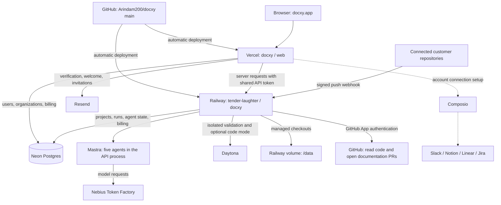

# What connects to what

This is the shared connection map for contributors and coding agents. Deployment
settings and production health were verified on **September 11, 2026**. Recheck
live state with `node scripts/check-deploy-targets.mjs`; a past verification is
not a guarantee that a later deployment succeeded.

## Production flow

Solid arrows describe the deployed architecture. Composio's key is configured
in Vercel production and validated. After deploying the connection UI through
`main`, authorize each account from the dashboard. The dotted path
does not imply notifications, publishing, or issue automation already run.

Two GitHub paths have different purposes. A push to **this application's main
branch** deploys the app on Vercel and Railway. A push to a **customer repository
connected as a Docxy project** reaches the GitHub App webhook and starts a
documentation run. Installing the App alone does not opt every repository into
documentation runs.

## Services and ownership

| Service | Owner / endpoint | Role and verified state |
|---|---|---|
| GitHub source | `Arindam200/docxy`, `main` | Both production platforms track this repository and branch. |
| Vercel | Team `arindam-1729`, project `docxy`; https://docxy.app | Dashboard, Better Auth, integration connection UI, transactional email and optional billing endpoints. Root directory `web/`, Node `24.x`. Production deployment is ready. |
| Railway | Project `tender-laughter`, service `docxy`, environment `production`; https://docxy-production.up.railway.app | Hono API, Mastra runtime, documentation pipeline, GitHub webhook. Docker build and `/health` pass; auto-deploy is enabled. |
| Neon | Shared `DATABASE_URL` on Vercel and Railway | Exact connection strings were compared and match. `public` and `billing` migrations belong to the root app; `auth` migrations belong to `web/`. |
| Mastra | Inside the Railway API process | Agent runtime, memory, workflows and sandbox integration. No separate harness server. |
| Nebius | Railway `NEBIUS_API_KEY` | Model provider. Backend health reports configured; no model request was made during the deployment check. |
| Daytona | Railway `DAYTONA_API_KEY` | Remote workspaces for validation and optional code mode. Backend health reports configured; no sandbox job was launched during this check. |
| Railway volume | `/data`; `DOCXY_STATE_DIR=/data/.docxy` | Persistent managed checkouts and local runtime files. Preserve it when updating the service. |
| GitHub App | `docxy-bot` | App identity and webhook settings were verified. Webhook is `https://docxy-production.up.railway.app/webhook`, JSON, TLS verification enabled. |
| Resend | Vercel environment | API key and email domain are configured. Mail delivery was not exercised in this check. |
| Composio | Vercel `COMPOSIO_API_KEY` | Key validated against the connected-account API. Organization-specific provider authorization is a separate user action. |
| Dodo Payments | Optional dashboard integration | Production credentials were absent during this verification. Code and database tables alone do not enable billing. |
| Render | No service identified in this repository or inspected account configuration | The verified backend host is Railway. Do not infer or provision an additional Render backend from a casual platform mention. |

Exact platform IDs and CLI commands are in [DEPLOY.md](DEPLOY.md#production-targets).
Both production deployments were verified against Git revision `7c7d598c3fca`.
That is a dated observation, not a revision to pin future deployments to.

## Where configuration belongs

| Configuration | Local development | Production | Constraint |
|---|---|---|---|
| `DOCXY_API_URL` | `web/.env.local`: `http://localhost:4317` | Vercel: `https://docxy-production.up.railway.app` | Read by the dashboard server; never use localhost on Vercel. |
| `DOCXY_API_TOKEN` | Root `.env` and `web/.env.local` | Railway and Vercel | Values must match. The deployed API refuses to boot without it. |
| `DATABASE_URL` | Root `.env` and `web/.env.local` | Railway and Vercel | Same database for the two halves of an environment. Use separate databases for isolated staging/development. |
| `BETTER_AUTH_SECRET`, public origin and optional sign-in providers | `web/.env.local` | Vercel | Authentication belongs to the web app. Canonical production URL is `https://docxy.app`. |
| `GITHUB_APP_ID`, private key, webhook secret | Root `.env` | Railway | Used for repository access, PR publication and webhook verification. Never copy private keys into docs. |
| `GITHUB_APP_SLUG`, App client ID and App client secret | `web/.env.local` | Vercel | Used for the GitHub App installation flow. These differ from optional GitHub sign-in OAuth credentials. |
| `NEBIUS_API_KEY`, `DAYTONA_API_KEY` | Root `.env` | Railway | Consumed by the backend; a copy on Vercel does not configure the backend. |
| `COMPOSIO_API_KEY`, optional toolkit auth config IDs | `web/.env.local` | Vercel | Consumed by the connection UI's server endpoints. Root `.env` is not loaded by Next.js in `web/`. |
| Resend and optional Dodo configuration | `web/.env.local` | Vercel | Resend enables product mail; Dodo additionally needs explicit billing configuration. |

Secret values stay in ignored environment files and platform settings. Never add
a `NEXT_PUBLIC_` prefix to these keys. Editing a local file does not synchronize
a hosted environment; changing hosted environment values requires a deployment.

Production auto-deployments use `main`. Vercel previews are separate deployments;
do not assume their credentials, URLs or data isolation match production. Configure
an explicit staging environment before treating previews as a full staging stack.

## Authentication and callbacks

- Better Auth owns user sign-in and organization membership in the `auth` schema.
  An owner or admin can manage an organization's Composio connections. Removed
  members cannot use a cached session to manage them.
- Vercel calls the Railway API with `DOCXY_API_TOKEN` and organization/project
  scope. The shared token authenticates the web server; it does not replace
  organization authorization.
- The GitHub App webhook uses `GITHUB_WEBHOOK_SECRET`, independently of the API
  token. Its production destination is the Railway `/webhook` endpoint.
- The GitHub App installation callback belongs on Vercel at
  `https://docxy.app/api/github/callback`; its setup return is
  `https://docxy.app/api/github/installed`. These are distinct from optional
  sign-in OAuth callbacks under `/api/auth/callback/*`.
- Composio owns provider credentials under the stable ID
  `docxy:org:<organization-id>`. Hosted authorization returns to
  `https://docxy.app/dashboard/integrations`. The page reads status from Composio;
  a success query parameter is not proof that an account connected.

See [GITHUB-APP.md](GITHUB-APP.md), [DATABASE.md](DATABASE.md) and
[COMPOSIO.md](COMPOSIO.md) for their detailed setup procedures.

## Retired deployment and failure history

`refreshing-tenderness/docxy` was the separate standalone harness. After the
Mastra migration, its remaining GitHub link deployed the current backend with
legacy variables such as `RAILWAY_DOCKERFILE_PATH=harness.Dockerfile`. It crashed
because it did not have `DOCXY_API_TOKEN` or the production backend configuration.

That obsolete service is now disconnected from GitHub. Its resources were not
deleted. Historical failures can remain visible on old commits; they do not mean
the running production backend is down. Do not reconnect this service or copy
production credentials into it. Future application pushes belong to the two
targets above.

## Keeping everyone in sync

When a connection or deployment target changes, update this map and the relevant
setup guide, then run `node scripts/check-deploy-targets.mjs`. Update [root agent
instructions](../AGENTS.md) if a deployment target changes. Include those docs
with the code/configuration change in GitHub so teammates and later agent sessions
get the same context. A file edited only on one laptop is not shared knowledge.

Use [OBSERVABILITY.md](OBSERVABILITY.md) to distinguish deployment failures,
provider configuration problems, and failures within an individual documentation
run. Automatic deployment cannot guarantee that arbitrary future code will build.
